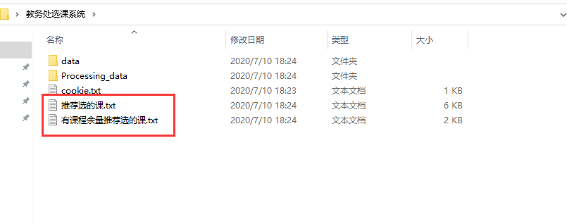
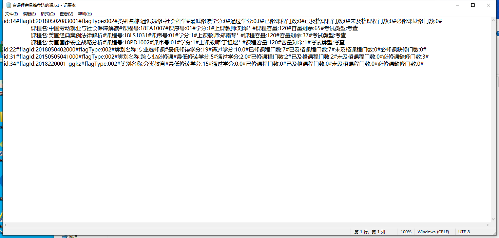

# 安徽财经大学选课推荐系统 v1.0
## 相关说明
这个程序已经将对服务器的压力降到最小了

只请求了5此次教务处的页面，相比较普通用户选课请求的次数远远大于5次

请求后的数据在本地进行处理和呈现

- 最后的结果在桌面的这个文件中 **教务处选课系统**

## 使用方法
0. 下载 run_this.py 文件 或者git clone 这个项目到本地
1. 需要安装requests的库: pip install requests 
1. 连接学校的vpn
2. 需要在浏览器的这个地方获取cookie ,可以参照后面的链接：[获取cookie的方法](https://jingyan.baidu.com/article/48a420571d8770a924250496.html)
cookie的形式类似于：`JSESSIONID=abcsOddTd0s4U4BddMZmx; selectionBar=1445673`
3. 运行 run_this.py 文件
4. 根据上面的指引，进行相关的操作